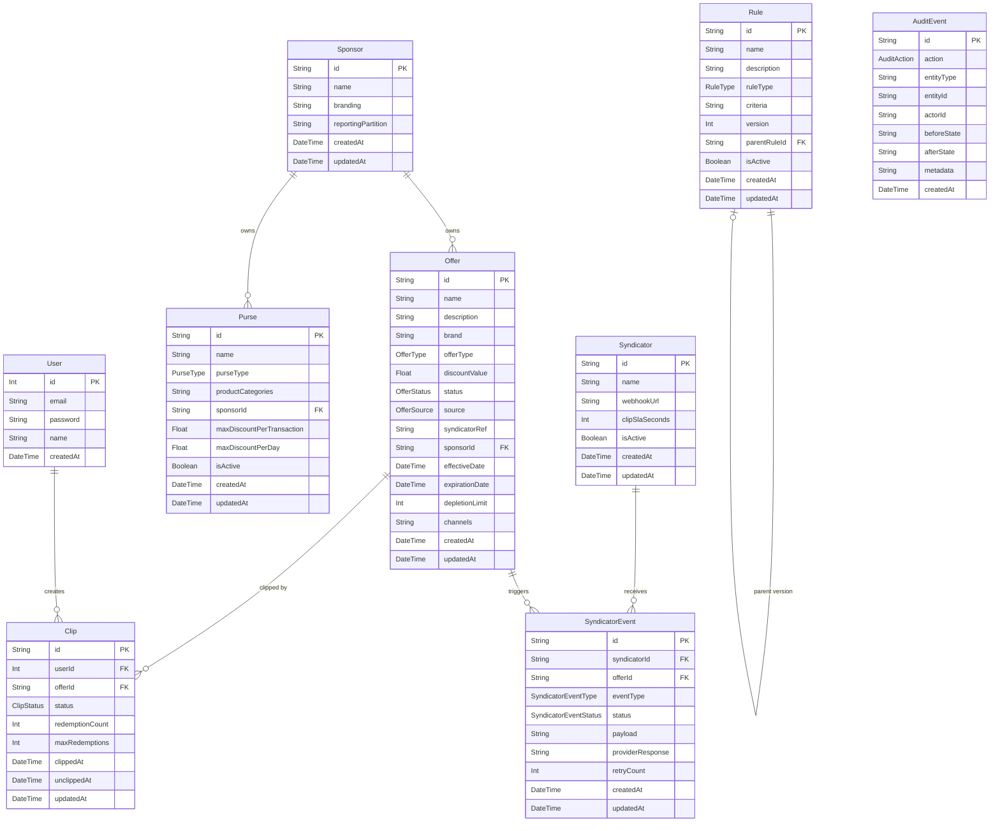

# Perks Engine — Design Document

**Date:** 2026-03-18
**Source:** BRD.md + User Story Issues

---

## 1. Architecture Overview

The Perks Engine is a three-tier web application: a React/Vite frontend, a Node.js/Express/TypeScript backend (split into Control Plane and Data Plane), and an SQLite database managed via Prisma ORM.

```mermaid
graph TD
    subgraph Frontend["Frontend (React + Vite)"]
        HP[HomePage / OfferDashboard]
        RP[RulesPage]
        SP[SponsorsPage]
        IP[IngestionPage]
        MOP[MemberOffersPage]
        AP[AuditPage]
    end

    subgraph Backend["Backend (Express + TypeScript)"]
        subgraph ControlPlane["Control Plane"]
            OR[/api/offers]
            RR[/api/rules]
            PR[/api/purses]
            SR[/api/sponsors]
            SyndR[/api/syndicator-events]
            RepR[/api/reports]
            AuR[/api/audit]
        end
        subgraph DataPlane["Data Plane"]
            TR[/api/transactions/evaluate]
            MR[/api/member]
        end
        Auth[JWT Auth Middleware]
    end

    subgraph Database["Database (SQLite via Prisma)"]
        DB[(perks.db)]
    end

    Frontend -->|REST/JSON over HTTP| Auth
    Auth --> ControlPlane
    Auth --> DataPlane
    ControlPlane --> DB
    DataPlane --> DB
```

---

## 2. Data Model

### 2.1 Prisma Schema

See `src/backend/prisma/schema.prisma` for the full schema. Key models are:

| Model | Type | Description |
|-------|------|-------------|
| User | PRE-BUILT | Authenticated users (Members and Admins) |
| Sponsor | NEW | Third-party entity funding Offers |
| Offer | NEW | Perks Offer with full lifecycle |
| Rule | NEW | Versioned eligibility policy |
| Purse | NEW | Benefit Purse (standard or Perks-only) |
| Syndicator | NEW | External Offer Provider |
| SyndicatorEvent | NEW | Outbound clip/unclip/redemption notification |
| Clip | NEW | Member clip state per Offer |
| AuditEvent | NEW | Immutable audit trail record |

### 2.2 ER Diagram



---

## 3. API Endpoints

All endpoints require a valid JWT Bearer token unless otherwise noted.

| Method | Path | Description | Auth Required |
|--------|------|-------------|---------------|
| POST | /api/auth/register | Register a new user | No |
| POST | /api/auth/login | Authenticate and receive JWT | No |
| POST | /api/offers | Create a new Offer (DRAFT) | Yes |
| GET | /api/offers | List/search Offers (`status`, `sponsorId`, `type`, `search`) | Yes |
| GET | /api/offers/pending-review | List INGESTED DRAFT Offers awaiting review | Yes |
| POST | /api/offers/ingest | Ingest Offers from a Syndicator | Yes |
| GET | /api/offers/:id | Get a single Offer by ID | Yes |
| PUT | /api/offers/:id | Update an Offer (DRAFT/CONFIGURED/ACTIVE only) | Yes |
| PATCH | /api/offers/:id/status | Transition Offer lifecycle state | Yes |
| POST | /api/rules | Create a new Rule (version 1) | Yes |
| GET | /api/rules | List active Rules (`ruleType` filter) | Yes |
| GET | /api/rules/:id | Get Rule by ID with version history | Yes |
| PUT | /api/rules/:id | Create new Rule version (increments version) | Yes |
| POST | /api/purses | Create a new Purse | Yes |
| GET | /api/purses | List Purses (`sponsorId`, `purseType` filters) | Yes |
| GET | /api/sponsors | List all Sponsors | Yes |
| GET | /api/sponsors/:id | Get Sponsor with Purses and Offers | Yes |
| PUT | /api/sponsors/:id | Update Sponsor branding/reporting partition | Yes |
| POST | /api/syndicator-events | Record a clip/unclip Syndicator event | Yes |
| GET | /api/syndicator-events | List SyndicatorEvents (`syndicatorId`, `offerId`, `eventType`, `status`) | Yes |
| GET | /api/reports/redemptions | Aggregated redemption report (`offerId`, `syndicatorId`, `from`, `to`) | Yes |
| POST | /api/transactions/evaluate | Evaluate Perks discounts for a Transaction | Yes |
| GET | /api/member/offers | Discover ACTIVE Offers for the authenticated Member (`merchantId`, `category`, `search`, `sponsorId`) | Yes |
| POST | /api/member/clips | Clip an Offer (`{ offerId }`) | Yes |
| DELETE | /api/member/clips/:offerId | Unclip an Offer | Yes |
| GET | /api/member/redemptions | Redemption history and savings summary (`from`, `to`) | Yes |
| GET | /api/audit | Query audit events (`entityType`, `entityId`, `action`, `actorId`, `from`, `to`) | Yes |
| GET | /api/audit/:entityType/:entityId | Full audit trail for a specific entity | Yes |

### 3.1 Response Shapes

**POST /api/offers** → 201
```json
{ "id": "string", "name": "string", "offerType": "AMOUNT_OFF", "discountValue": 10, "status": "DRAFT", "sponsorId": "string", "effectiveDate": "ISO", "expirationDate": "ISO|null", "createdAt": "ISO" }
```

**GET /api/offers** → 200
```json
{ "offers": [{ "id": "string", "name": "string", "offerType": "string", "discountValue": 0, "status": "string", "sponsorId": "string", "effectiveDate": "ISO", "expirationDate": "ISO|null" }] }
```

**PATCH /api/offers/:id/status** — Valid transitions:
- `DRAFT → CONFIGURED`
- `CONFIGURED → ACTIVE`
- `ACTIVE → SUSPENDED`
- `ACTIVE → EXPIRED`
- `SUSPENDED → ACTIVE`
- `SUSPENDED → EXPIRED`
- `EXPIRED → ARCHIVED`

**GET /api/member/offers** → 200
```json
{ "offers": [{ "id": "string", "name": "string", "description": "string", "offerType": "string", "discountValue": 0, "effectiveDate": "ISO", "expirationDate": "ISO|null", "clipped": true }] }
```

**POST /api/transactions/evaluate** → 200
```json
{
  "perksAvailable": true,
  "appliedOffers": [{ "offerId": "string", "offerName": "string", "discountAmount": 0 }],
  "totalPerksDiscount": 0,
  "lineItems": [{ "productId": "string", "originalPrice": 0, "perksDiscount": 0, "finalPrice": 0 }]
}
```

**GET /api/member/redemptions** → 200
```json
{ "totalSaved": 0, "redemptionCount": 0, "history": [{ "offerName": "string", "amountSaved": 0, "merchant": "string", "redeemedAt": "ISO" }] }
```

**GET /api/audit** → 200
```json
{ "events": [{ "id": "string", "action": "string", "entityType": "string", "entityId": "string", "actorId": "string|null", "beforeState": "string|null", "afterState": "string|null", "metadata": "string|null", "createdAt": "ISO" }] }
```

**Error response shape (all endpoints):**
```json
{ "error": "string" }
```

---

## 4. Component Structure

```mermaid
graph TD
    App["App.tsx (Router + Auth Guard)"]

    App --> Navbar["Navbar.tsx"]
    App --> LoginPage["LoginPage.tsx (pre-built)"]
    App --> RegisterPage["RegisterPage.tsx (pre-built)"]
    App --> HomePage["HomePage.tsx → renders OfferDashboard"]
    App --> RulesPage["RulesPage.tsx [/rules]"]
    App --> SponsorsPage["SponsorsPage.tsx [/sponsors]"]
    App --> IngestionPage["IngestionPage.tsx [/ingestion]"]
    App --> MemberOffersPage["MemberOffersPage.tsx [/my-offers]"]
    App --> AuditPage["AuditPage.tsx [/audit]"]

    HomePage --> OfferDashboard["OfferDashboard\ndata-testid=offer-dashboard"]
    OfferDashboard --> OfferList["OfferList\ndata-testid=offer-list"]
    OfferDashboard --> CreateOfferButton["Button: New Offer\ndata-testid=create-offer-button"]
    OfferDashboard --> OfferSearchInput["Input: search\ndata-testid=offer-search-input"]
    OfferDashboard --> OfferStatusFilter["Select: status\ndata-testid=offer-status-filter"]
    OfferList --> OfferCard["OfferCard (×N)\ndata-testid=offer-card"]
    OfferCard --> OfferStatusBadge["OfferStatusBadge\ndata-testid=offer-status-badge"]
    OfferCard --> OfferActions["OfferActions"]
    OfferActions --> ConfigureBtn["Configure\ndata-testid=configure-offer-button"]
    OfferActions --> ActivateBtn["Activate\ndata-testid=activate-offer-button"]
    OfferActions --> SuspendBtn["Suspend\ndata-testid=suspend-offer-button"]
    OfferActions --> ReactivateBtn["Reactivate\ndata-testid=reactivate-offer-button"]
    OfferActions --> ArchiveBtn["Archive\ndata-testid=archive-offer-button"]
    OfferDashboard --> OfferForm["OfferForm (modal)"]
    OfferForm --> OfferNameInput["Input: name\ndata-testid=offer-name-input"]
    OfferForm --> OfferTypeSelect["Select: offerType\ndata-testid=offer-type-select"]
    OfferForm --> OfferDiscountInput["Input: discountValue\ndata-testid=offer-discount-input"]
    OfferForm --> OfferSponsorSelect["Select: sponsorId\ndata-testid=offer-sponsor-select"]
    OfferForm --> OfferEffDateInput["Input: effectiveDate\ndata-testid=offer-effective-date-input"]
    OfferForm --> OfferFormSubmit["Button: Create\ndata-testid=offer-form-submit"]

    RulesPage --> RuleList["RuleList\ndata-testid=rule-list"]
    RulesPage --> CreateRuleButton["Button: New Rule\ndata-testid=create-rule-button"]
    RuleList --> RuleCard["RuleCard (×N)\ndata-testid=rule-card"]
    RuleCard --> RuleVersionBadge["RuleVersionBadge\ndata-testid=rule-version-badge"]
    RuleCard --> UpdateRuleButton["Button: Update\ndata-testid=update-rule-button"]
    RulesPage --> RuleForm["RuleForm (modal)"]
    RuleForm --> RuleNameInput["Input: name\ndata-testid=rule-name-input"]
    RuleForm --> RuleTypeSelect["Select: ruleType\ndata-testid=rule-type-select"]
    RuleForm --> RuleCriteriaInput["Textarea: criteria\ndata-testid=rule-criteria-input"]
    RuleForm --> RuleFormSubmit["Button: Create/Update\ndata-testid=rule-form-submit"]

    SponsorsPage --> SponsorList["SponsorList\ndata-testid=sponsor-list"]
    SponsorList --> SponsorCard["SponsorCard (×N)\ndata-testid=sponsor-card"]
    SponsorCard --> SponsorDetail["SponsorDetail\ndata-testid=sponsor-detail"]
    SponsorDetail --> PurseList["PurseList\ndata-testid=purse-list"]
    SponsorDetail --> CreatePurseButton["Button: New Purse\ndata-testid=create-purse-button"]
    PurseList --> PurseCard["PurseCard (×N)\ndata-testid=purse-card"]
    PurseCard --> PurseTypeBadge["PurseTypeBadge\ndata-testid=purse-type-badge"]
    SponsorsPage --> PurseForm["PurseForm (modal)"]
    PurseForm --> PurseNameInput["Input: name\ndata-testid=purse-name-input"]
    PurseForm --> PurseTypeSelect["Select: purseType\ndata-testid=purse-type-select"]
    PurseForm --> PurseSponsorSelect["Select: sponsorId\ndata-testid=purse-sponsor-select"]
    PurseForm --> PurseMaxDiscountInput["Input: maxDiscountPerTransaction\ndata-testid=purse-max-discount-input"]
    PurseForm --> PurseFormSubmit["Button: Create\ndata-testid=purse-form-submit"]

    IngestionPage --> IngestionQueue["IngestionQueue\ndata-testid=ingestion-queue"]
    IngestionQueue --> IngestedOfferCard["IngestionOfferCard (×N)\ndata-testid=ingested-offer-card"]
    IngestedOfferCard --> IngestedSyndicatorRef["syndicatorRef display\ndata-testid=ingested-offer-syndicator-ref"]
    IngestedOfferCard --> EditIngestedNameInput["Input: name\ndata-testid=edit-ingested-name-input"]
    IngestedOfferCard --> EditIngestedDiscountInput["Input: discountValue\ndata-testid=edit-ingested-discount-input"]
    IngestedOfferCard --> SaveIngestedEditsButton["Button: Save\ndata-testid=save-ingested-edits-button"]
    IngestedOfferCard --> ApproveOfferButton["Button: Approve\ndata-testid=approve-offer-button"]
    IngestedOfferCard --> RejectOfferButton["Button: Reject\ndata-testid=reject-offer-button"]

    MemberOffersPage --> AvailableOffersList["AvailableOffersList\ndata-testid=available-offers-list"]
    MemberOffersPage --> SavingsSummary["SavingsSummary\ndata-testid=savings-summary"]
    MemberOffersPage --> MemberOfferSearchInput["Input: search\ndata-testid=member-offer-search-input"]
    MemberOffersPage --> RedemptionHistory["RedemptionHistory\ndata-testid=redemption-history-list"]
    AvailableOffersList --> OfferDetailCard["OfferDetailCard (×N)\ndata-testid=offer-detail-card"]
    OfferDetailCard --> ClipButton["Button: Clip\ndata-testid=clip-button"]
    OfferDetailCard --> UnclipButton["Button: Unclip\ndata-testid=unclip-button"]
    OfferDetailCard --> ClippedBadge["ClippedBadge\ndata-testid=clipped-badge"]
    SavingsSummary --> SavingsTotal["total savings\ndata-testid=savings-total"]
    SavingsSummary --> SavingsCount["redemption count\ndata-testid=savings-count"]
    RedemptionHistory --> RedemptionHistoryItem["RedemptionHistoryItem (×N)\ndata-testid=redemption-history-item"]

    AuditPage --> AuditLogList["AuditLogList\ndata-testid=audit-log-list"]
    AuditPage --> AuditFilters["AuditFilters"]
    AuditLogList --> AuditEventRow["AuditEventRow (×N)\ndata-testid=audit-event-row"]
    AuditEventRow --> AuditActionBadge["action badge\ndata-testid=audit-action-badge"]
    AuditFilters --> AuditFilterEntityType["Select: entityType\ndata-testid=audit-filter-entity-type"]
    AuditFilters --> AuditFilterAction["Select: action\ndata-testid=audit-filter-action"]
    AuditFilters --> AuditFilterFromDate["Input: from date\ndata-testid=audit-filter-from-date"]
    AuditFilters --> AuditFilterToDate["Input: to date\ndata-testid=audit-filter-to-date"]
```



---

## 5. Key Flows

### 5.1 Offer Lifecycle (Operations Admin)

```mermaid
sequenceDiagram
    actor Admin as Operations Admin
    participant UI as OfferDashboard (React)
    participant API as Express API
    participant DB as SQLite (Prisma)

    Admin->>UI: Click "New Offer" (create-offer-button)
    UI->>UI: Open OfferForm modal
    Admin->>UI: Fill form fields and submit (offer-form-submit)
    UI->>API: POST /api/offers { name, offerType, discountValue, sponsorId, ... }
    API->>DB: prisma.offer.create({ status: DRAFT })
    DB-->>API: Offer record
    API->>DB: prisma.auditEvent.create({ action: OFFER_CREATED })
    API-->>UI: 201 { id, name, status: DRAFT, ... }
    UI->>UI: Append new card to offer-list with DRAFT badge

    Admin->>UI: Click "Configure" (configure-offer-button) on DRAFT card
    UI->>API: PATCH /api/offers/:id/status { status: CONFIGURED }
    API->>DB: Validate DRAFT→CONFIGURED transition
    API->>DB: prisma.offer.update({ status: CONFIGURED })
    API->>DB: prisma.auditEvent.create({ action: OFFER_STATE_CHANGED, before: DRAFT, after: CONFIGURED })
    API-->>UI: 200 updated Offer
    UI->>UI: Badge changes to CONFIGURED; show "Activate" button

    Admin->>UI: Click "Activate" (activate-offer-button)
    UI->>API: PATCH /api/offers/:id/status { status: ACTIVE }
    API->>DB: Validate CONFIGURED→ACTIVE transition
    API->>DB: prisma.offer.update({ status: ACTIVE })
    API->>DB: prisma.auditEvent.create({ action: OFFER_STATE_CHANGED, before: CONFIGURED, after: ACTIVE })
    API-->>UI: 200 updated Offer
    UI->>UI: Badge changes to ACTIVE; show "Suspend" button
```

### 5.2 Member Clip & Transaction Evaluation

```mermaid
sequenceDiagram
    actor Member
    participant UI as MemberOffersPage (React)
    participant API as Express API
    participant DB as SQLite (Prisma)

    Member->>UI: Navigate to /my-offers
    UI->>API: GET /api/member/offers
    API->>DB: Query ACTIVE Offers; LEFT JOIN Clips for userId
    DB-->>API: Offers with clipped flag
    API-->>UI: { offers: [..., clipped: boolean] }
    UI->>UI: Render AvailableOffersList with clip state

    Member->>UI: Click "Clip" (clip-button) on offer card
    UI->>API: POST /api/member/clips { offerId }
    API->>DB: prisma.clip.create({ userId, offerId, status: ACTIVE })
    API->>DB: prisma.auditEvent.create({ action: CLIP_CREATED })
    API-->>UI: 201 { id, offerId, status: ACTIVE, clippedAt }
    UI->>UI: Show ClippedBadge + UnclipButton; hide ClipButton

    Member->>UI: Click "Unclip" (unclip-button)
    UI->>API: DELETE /api/member/clips/:offerId
    API->>DB: prisma.clip.update({ status: UNCLIPPED, unclippedAt: now() })
    API->>DB: prisma.auditEvent.create({ action: CLIP_UNCLIPPED })
    API-->>UI: 200 { id, offerId, status: UNCLIPPED, unclippedAt }
    UI->>UI: Show ClipButton; hide ClippedBadge + UnclipButton

    Note over API,DB: Later — Transaction Evaluation (Data Plane)
    API->>DB: Resolve ACTIVE Offers matching sponsorId, merchant, date window
    API->>DB: Filter: Clip.userId=memberId AND Clip.status=ACTIVE
    API->>API: Apply priority + combination rules; enforce Purse caps
    API->>DB: prisma.auditEvent.create({ action: REDEMPTION_APPLIED })
    API-->>API: Return discount breakdown
```

---

## 6. Seed Data

### 6.1 Sponsors (3 records)

| id (cuid) | name | reportingPartition | branding |
|-----------|------|--------------------|---------|
| auto | GroceryCo | groceryco-001 | null |
| auto | FuelPlus | fuelplus-001 | null |
| auto | TechDeals | techdeals-001 | null |

### 6.2 Offers (6 records)

| name | offerType | discountValue | status | source | sponsorId | effectiveDate | expirationDate |
|------|-----------|---------------|--------|--------|-----------|---------------|----------------|
| 10% Off Groceries | PERCENTAGE_OFF | 10 | ACTIVE | MANUAL | GroceryCo | today−7d | today+30d |
| $5 Off Fuel | AMOUNT_OFF | 5 | ACTIVE | MANUAL | FuelPlus | today−3d | today+14d |
| Fixed Price Electronics | FIXED_PRICE | 99 | CONFIGURED | MANUAL | TechDeals | today+1d | today+60d |
| Summer Grocery Bundle | AMOUNT_OFF | 15 | DRAFT | MANUAL | GroceryCo | today+7d | null |
| Weekend Fuel Discount | PERCENTAGE_OFF | 8 | SUSPENDED | MANUAL | FuelPlus | today−14d | today+7d |
| Tech Clearance | PERCENTAGE_OFF | 20 | EXPIRED | MANUAL | TechDeals | today−60d | today−1d |

### 6.3 Rules (5 records — includes v1 parent for Electronics rule)

| name | ruleType | criteria (JSON) | version | isActive | parentRuleId |
|------|----------|-----------------|---------|----------|--------------|
| Grocery Category Inclusion | PRODUCT_CATEGORY | `{"categories":["groceries","fresh-produce"],"action":"include"}` | 1 | true | null |
| Fuel Station Merchant Rule | MERCHANT_LOCATION | `{"merchantTypes":["fuel-station","petrol"],"action":"include"}` | 1 | true | null |
| Electronics Category Rule v1 | PRODUCT_CATEGORY | `{"categories":["electronics"],"action":"include"}` | 1 | false | null |
| Electronics Category Rule | PRODUCT_CATEGORY | `{"categories":["electronics","computers"],"action":"include"}` | 2 | true | Electronics v1 id |
| Premium Member Eligibility | MEMBER_ATTRIBUTE | `{"attribute":"memberTier","values":["premium","gold"]}` | 1 | true | null |

### 6.4 Purses (4 records)

| name | purseType | sponsorId | productCategories | maxDiscountPerTransaction | maxDiscountPerDay |
|------|-----------|-----------|-------------------|--------------------------|-------------------|
| GroceryCo Standard Purse | STANDARD | GroceryCo | `["groceries","fresh-produce"]` | 50.0 | null |
| FuelPlus Perks Purse | PERKS_ONLY | FuelPlus | `["fuel"]` | 20.0 | null |
| TechDeals Perks Purse | PERKS_ONLY | TechDeals | `["electronics"]` | 100.0 | null |
| GroceryCo Perks Purse | PERKS_ONLY | GroceryCo | `["groceries"]` | 30.0 | 60.0 |

### 6.5 Syndicators (2 records)

| name | webhookUrl | clipSlaSeconds | isActive |
|------|-----------|----------------|---------|
| OfferHub | https://api.offerhub.example.com/events | 15 | true |
| PerkStream | https://notify.perkstream.example.com/clips | 30 | true |

### 6.6 SyndicatorEvents (4 records)

| syndicatorId | offerId | eventType | status | retryCount |
|-------------|---------|-----------|--------|-----------|
| OfferHub | 10% Off Groceries | CLIP | ACKNOWLEDGED | 0 |
| OfferHub | $5 Off Fuel | CLIP | SENT | 0 |
| PerkStream | 10% Off Groceries | REDEMPTION | ACKNOWLEDGED | 0 |
| PerkStream | Weekend Fuel Discount | DEPLETION | FAILED | 2 |

### 6.7 Clips (3 records — for test@example.com)

| userId | offerId | status | redemptionCount |
|--------|---------|--------|-----------------|
| test user | 10% Off Groceries (ACTIVE) | ACTIVE | 1 |
| test user | $5 Off Fuel (ACTIVE) | ACTIVE | 0 |
| test user | Tech Clearance (EXPIRED) | EXPIRED | 2 |

### 6.8 AuditEvents (5 records)

| action | entityType | entityId | actorId | beforeState | afterState | metadata |
|--------|-----------|---------|---------|-------------|------------|---------|
| OFFER_CREATED | Offer | 10% Off Groceries id | test user id | null | `{"status":"DRAFT"}` | null |
| OFFER_STATE_CHANGED | Offer | 10% Off Groceries id | test user id | `{"status":"DRAFT"}` | `{"status":"CONFIGURED"}` | null |
| OFFER_STATE_CHANGED | Offer | 10% Off Groceries id | test user id | `{"status":"CONFIGURED"}` | `{"status":"ACTIVE"}` | null |
| CLIP_CREATED | Clip | clip id (10% Off Groceries) | test user id | null | `{"status":"ACTIVE"}` | null |
| REDEMPTION_APPLIED | Clip | clip id (10% Off Groceries) | test user id | null | null | `{"amountSaved":5.50,"merchant":"FreshMart"}` |

---

## 7. Implementation Order

Follow this order to avoid dependency failures:

1. **[DATABASE] Offer Lifecycle Management** — Sponsor, Offer models + seed
2. **[DATABASE] Rules & Eligibility** — Rule model + seed
3. **[DATABASE] Purse & Sponsor Configuration** — Purse model + seed
4. **[DATABASE] Syndicator Notifications & Reporting** — Syndicator, SyndicatorEvent models + seed
5. **[DATABASE] Member APIs** — Clip model + seed
6. **[DATABASE] Audit & Events** — AuditEvent model + seed
7. **[BACKEND] Offer Lifecycle Management** — Offer CRUD + state transitions
8. **[BACKEND] Rules & Eligibility** — Rule CRUD + versioning
9. **[BACKEND] Purse & Sponsor Configuration** — Purse CRUD + Sponsor endpoints
10. **[BACKEND] Offer Ingestion** — Ingest + pending-review endpoints
11. **[BACKEND] Syndicator Notifications & Reporting** — SyndicatorEvent + reports
12. **[BACKEND] Transaction Evaluation** — Data Plane evaluation pipeline
13. **[BACKEND] Member APIs** — Offer discovery, clip/unclip, redemption history
14. **[BACKEND] Audit & Events** — Audit query endpoints + controller integration
15. **[FRONTEND] Offer Lifecycle Management** — OfferDashboard on HomePage
16. **[FRONTEND] Rules & Eligibility** — RulesPage
17. **[FRONTEND] Purse & Sponsor Configuration** — SponsorsPage
18. **[FRONTEND] Offer Ingestion** — IngestionPage
19. **[FRONTEND] Member APIs** — MemberOffersPage
20. **[FRONTEND] Audit & Events** — AuditPage
21. **[PLAYWRIGHT] Perks Engine** — E2E test suite
